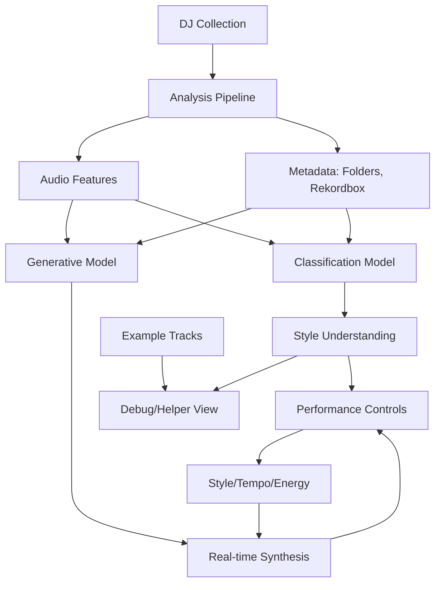

# MusicMill Implementation Summary

## Project Goal

**Primary Objective**: Build a generative music instrument that synthesizes new audio in real-time based on the DJ collection, controlled by style/tempo/energy parameters.

**Current State**: Skeleton implementation with classification and track selection as stepping stones toward generation.

## Architecture Overview



## Completed Components (Skeleton)

### 1. Project Structure ✓
- Created complete Swift project structure
- All source files organized by functionality
- App entry point and main views

### 2. Analysis Pipeline ✓
- **AudioAnalyzer**: Scans music collection, supports MP3/AAC/WAV/AIFF, extracts training segments
- **FeatureExtractor**: Extracts tempo, key, energy, spectral features from audio
- **TrainingDataManager**: Organizes training data by directory structure, manages samples

### 3. ML Components ✓
- **ModelTrainer**: Trains MLSoundClassifier models (template - adjust per actual API)
- **ModelManager**: Saves/loads trained models, manages model metadata
- **TrackSelector**: Classifies tracks once when loading collection (helper/debug feature)

### 4. Performance Interface ✓
- **PerformanceView**: Main UI with style controls, tempo/energy sliders
- **StyleController**: Manages style/genre selection and intensity
- **TrackSelector**: Shows example tracks matching current desired output (debug helper)
- **PlaybackController**: AVFoundation-based playback (for generated audio)
- **MixingEngine**: Real-time audio mixing with crossfade, volume, and EQ

### 5. Training Interface ✓
- **TrainingView**: Complete UI for directory selection, analysis, and model training
- Progress tracking and model management

## File Structure

```
MusicMill/
├── MusicMill/
│   ├── App/
│   │   ├── MusicMillApp.swift      # App entry point
│   │   └── ContentView.swift       # Main tab view
│   ├── Analysis/
│   │   ├── AudioAnalyzer.swift     # Audio file scanning
│   │   ├── FeatureExtractor.swift  # Feature extraction
│   │   └── TrainingDataManager.swift # Training data management
│   ├── ML/
│   │   ├── ModelTrainer.swift      # Classification model training
│   │   └── ModelManager.swift      # Model persistence
│   ├── Performance/
│   │   ├── PerformanceView.swift   # Main performance UI
│   │   ├── StyleController.swift   # Style selection
│   │   ├── TrackSelector.swift     # Track classification (helper/debug)
│   │   ├── PlaybackController.swift # Playback control (for generated audio)
│   │   └── MixingEngine.swift      # Audio mixing
│   └── Training/
│       └── TrainingView.swift      # Training UI
├── README.md
├── SETUP.md
└── IMPLEMENTATION.md
```

## Key Features Implemented (Skeleton)

1. **Music Collection Analysis**
   - Directory scanning with format support
   - Audio segment extraction for training
   - Feature extraction (tempo, energy, spectral)

2. **Classification Model Training**
   - MLSoundClassifier integration (template)
   - Training/validation split
   - Model persistence
   - **Purpose**: Understand styles in collection (stepping stone)

3. **Performance Interface Scaffolding**
   - Style/genre selection controls
   - Tempo (BPM) control
   - Energy/intensity control
   - Track recommendations (debug helper - shows examples matching desired output)

## Missing Components (Primary Goals)

### 1. Generative Model Training
- **Status**: Not implemented
- **Goal**: Train models that can generate audio based on style/tempo/energy
- **Approach**: 
  - Can use unsupervised learning from raw audio
  - Can use supervised learning from labels (folders, Rekordbox metadata)
  - May need to explore different architectures (VAE, GAN, Diffusion, etc.)

### 2. Real-time Audio Synthesis Engine
- **Status**: Not implemented
- **Goal**: Generate audio in real-time based on control parameters
- **Requirements**:
  - Low-latency generation
  - Style-guided output
  - Tempo/energy control
  - Integration with MixingEngine for live performance

### 3. Rekordbox Metadata Integration
- **Status**: Not implemented
- **Goal**: Extract and use Rekordbox collection data
- **Data Sources**:
  - Cue points
  - Play history
  - Play counts
  - Other metadata

## Implementation Roadmap

### Phase 1: Foundation (Current)
- ✅ Project structure
- ✅ Audio analysis pipeline
- ✅ Classification model training (stepping stone)
- ✅ Basic UI scaffolding

### Phase 2: Classification & Understanding
- Complete MLSoundClassifier integration
- Track classification for debug/helper features
- Style understanding from collection
- **Purpose**: Verify model understands collection correctly

### Phase 3: Generative Model Research & Implementation
- Research audio generation techniques suitable for real-time synthesis
- Implement generative model training pipeline
- Train initial models (expect poor quality initially)
- Iterate on model architecture and training

### Phase 4: Real-time Synthesis
- Implement real-time audio generation engine
- Connect style/tempo/energy controls to generation
- Integrate with MixingEngine for live performance
- Optimize for low latency

### Phase 5: Enhancement
- Improve generation quality
- Add Rekordbox metadata integration
- Advanced controls and effects
- MIDI integration

## Notes

- **Track selection is a helper feature**, not the primary goal
- **Audio generation is the main challenge** - this is experimental
- Initial generative output quality may be poor - that's expected and part of the exploration
- Classification models help understand the collection and can guide generation
- Rekordbox metadata provides additional training signals (play history, cue points, etc.)

## Technical Challenges

1. **Real-time Audio Generation**: Generating high-quality audio in real-time is computationally intensive
2. **Style Control**: Ensuring generated audio matches desired style characteristics
3. **Tempo/Energy Control**: Controlling generative model parameters in real-time
4. **Model Architecture**: Finding/designing architectures suitable for real-time music generation
5. **Training Data**: Effectively using both labeled and unlabeled data from the collection
