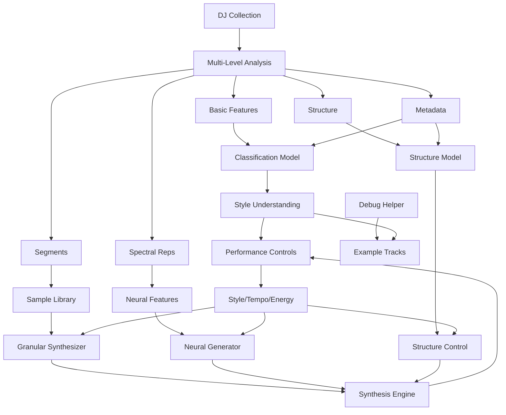

# MusicMill: Generative Music Synthesis System

## Core Goal

Build a real-time generative music instrument that creates new audio based on your DJ collection, controlled by style/tempo/energy parameters. The music is synthesizer-based (synthwave, darkwave), which may make pure synthesis more feasible than acoustic music.

## Generation Approach Exploration

Since we don't know which approach will work best, the plan supports multiple paths and we'll implement all of them:

### Approach 1: Granular Synthesis (Primary Starting Point)

**Concept**: Break audio into small grains (typically 10-100ms), then recombine them with control over grain size, density, position, pitch, and envelope.

**Why Granular Synthesis is Ideal for This Project**:

- **Preserves Nuanced Sounds**: Can maintain the polished, nuanced characteristics of your synthwave/darkwave collection
- **Real-time Control**: Excellent for live performance - grain parameters can be controlled in real-time
- **Smooth Transitions**: Can blend between different samples seamlessly by crossfading grains
- **Computationally Efficient**: More efficient than full neural synthesis for real-time use
- **Style Blending**: Can mix grains from different styles to create hybrid textures
- **Tempo Control**: Pitch-shifting grains allows tempo changes without affecting pitch (or vice versa)
- **Texture Evolution**: Can create evolving textures by varying grain density and position over time

**Implementation Approaches**:

#### Option A: Pure Swift/AVFoundation

- **Pros**: 
  - Native integration, no external dependencies
  - Full control over implementation
  - Can optimize specifically for our use case
  - Easier debugging and integration with SwiftUI
- **Cons**: 
  - Need to implement granular synthesis from scratch
  - More development time initially
  - Need to handle grain scheduling, windowing, buffering ourselves
- **Technical Requirements**:
  - AVAudioEngine for real-time audio
  - Custom AVAudioNode for grain generation
  - Ring buffers for sample storage
  - Grain scheduler (timer-based or sample-accurate)
  - Windowing functions (Hann, Hamming, etc.)
  - Pitch/time stretching algorithms

#### Option B: SuperCollider Integration

- **Pros**: 
  - Battle-tested granular synthesis (TGrains, GrainBuf UGens)
  - Extensive synthesis capabilities
  - Active community and documentation
  - Can focus on high-level control logic
- **Cons**: 
  - External dependency (SuperCollider server)
  - Integration complexity (SCPlugin, OSC communication)
  - Less direct control over low-level details
  - Additional deployment considerations
- **Integration Options**:
  - Embed SuperCollider server as subprocess
  - Use SCPlugin framework (if available for macOS)
  - OSC communication between Swift and SuperCollider
  - SuperCollider handles audio, Swift handles UI/control

#### Recommendation: Start with Swift/AVFoundation

- **Rationale**: 
  - Better integration with existing Swift codebase
  - More control for experimentation
  - Can always add SuperCollider later if needed
  - Granular synthesis is feasible to implement in Swift
  - M3 Mac performance should handle it well

**Granular Synthesis Parameters to Control**:

- **Grain Size**: Duration of each grain (10-100ms typical)
- **Grain Density**: Grains per second (controls texture)
- **Grain Position**: Where in source sample to read from
- **Pitch**: Grain playback speed (affects pitch)
- **Envelope Shape**: Attack/decay of grain (Hann, Hamming, etc.)
- **Pan**: Stereo position of grain
- **Amplitude**: Volume of grain

**Analysis Needed for Granular Synthesis**:

- Segment boundaries (where to extract grains from)
- Style classification per segment
- Tempo/key matching for smooth transitions
- Onset detection (good grain start points)
- Spectral features (for intelligent grain selection)

### Approach 2: Pure Neural Synthesis

**Concept**: Generate audio from scratch using neural networks trained on the collection.

**Pros**:

- Fully creative, can create new combinations
- Not limited to existing material
- Can learn abstract style representations

**Cons**:

- Hard to achieve polished quality initially
- Computationally intensive
- May require significant training data

**Techniques**:

- VAE (Variational Autoencoders) - learn latent space
- GAN (Generative Adversarial Networks) - adversarial training
- Diffusion models - iterative refinement
- Transformer-based (MusicLM-style) - sequence modeling

**Synthwave Advantage**: Synthesized sounds are more structured/predictable than acoustic, potentially making neural generation more feasible.

**Analysis Needed**:

- Raw audio features
- Spectral representations (mel-spectrograms)
- Latent space learning
- Style embeddings

### Approach 3: Hybrid Approach

**Concept**: Use granular synthesis as foundation, apply neural transformation/conditioning.

**Pros**:

- Balance of quality (from samples) and creativity (from neural)
- Can use neural models to guide grain selection
- Neural style transfer on grains

**Cons**:

- More complex architecture
- Need both systems working

**Techniques**:

- Neural-guided grain selection
- Style transfer on grains
- Neural resynthesis of grains
- Parameter interpolation using neural models

### Approach 4: Parameter-Based Synthesis

**Concept**: Model synth parameters directly, generate via traditional synthesis.

**Pros**:

- Very controllable
- Potentially high quality
- Direct parameter control

**Cons**:

- Requires extracting synth parameters (hard for mixed/mastered tracks)
- May not capture all nuances

**Techniques**:

- Parameter estimation from audio
- MIDI-like control
- Traditional synth engines (AU plugins)

## Flexible Analysis Architecture

Since we don't know what analysis will be useful, build a modular system that can extract multiple feature types:

### Level 1: Basic Audio Features (Current)

- Tempo, key, energy, spectral centroid, RMS energy
- **Useful for**: All approaches (matching, conditioning)

### Level 2: Segment-Level Analysis

- Extract meaningful segments (beats, phrases, loops)
- Style classification per segment
- Onset detection, beat tracking
- Segment boundaries and transitions
- **Useful for**: Granular synthesis, sample-based, hybrid approaches

### Level 3: Spectral/Representation Analysis

- Mel-spectrograms, chromagrams
- Harmonic/percussive separation
- Spectral features for neural models
- STFT, CQT representations
- **Useful for**: Pure synthesis, neural approaches, style analysis

### Level 4: High-Level Musical Structure

- Chord progressions, phrase boundaries
- Section detection (intro, verse, chorus)
- Pattern recognition
- Repetition detection
- **Useful for**: All approaches (structure understanding, intelligent grain selection)

### Level 5: Metadata Integration

- Rekordbox: cue points, play history, play counts
- Folder structure (style labels)
- **Useful for**: Training signals, style understanding, grain selection hints

## Implementation Phases

### Phase 1: Foundation & Exploration (Current)

- ✅ Project structure
- ✅ Basic audio analysis
- ✅ Classification models (stepping stone)
- **Next**: Expand analysis capabilities flexibly

### Phase 2: Analysis Expansion

- Implement multiple analysis levels
- Segment extraction and classification
- Spectral analysis for neural approaches
- Rekordbox metadata integration
- **Goal**: Have rich data available for any generation approach

### Phase 3: Granular Synthesis Implementation

- **Decision Point**: Swift/AVFoundation vs SuperCollider
- Implement granular synthesizer (start with Swift)
- Grain scheduling and windowing
- Real-time parameter control
- Sample library with metadata
- **Goal**: Get granular synthesis working as foundation

### Phase 4: Sample-Based Generation with Granular

- Extract and catalog segments from collection
- Style/tempo/key matching system
- Real-time grain recombination engine
- Smooth transitions between samples
- **Goal**: Get something working quickly, validate concept

### Phase 5: Neural Generation Research & Implementation

- Research/implement neural audio generation
- Train models on collection
- Real-time synthesis engine
- **Goal**: Explore pure generation, accept initial poor quality

### Phase 6: Hybrid & Integration

- Combine granular + neural approaches
- Neural-guided grain selection
- Improve quality iteratively
- Optimize for real-time performance

## Architecture Design



## Implementation Concerns & Technical Details

### Granular Synthesis Implementation (Swift/AVFoundation)

**Core Components**:

1. **Grain Structure**:
   ```swift
   struct Grain {
       let sourceBuffer: AVAudioPCMBuffer
       let startPosition: Int // Sample index in source
       let size: Int // Grain size in samples
       let pitch: Float // Playback speed (1.0 = normal)
       let envelope: EnvelopeType // Hann, Hamming, etc.
       let pan: Float // Stereo position
       let amplitude: Float
   }
   ```

2. **Grain Scheduler**:

   - Schedule grains based on density (grains/second)
   - Manage grain lifecycle (creation, playback, cleanup)
   - Handle overlapping grains
   - Sample-accurate timing

3. **Windowing**:

   - Implement window functions (Hann, Hamming, Blackman)
   - Apply to grains to prevent clicks
   - Smooth grain boundaries

4. **Buffer Management**:

   - Pre-load samples into AVAudioPCMBuffer
   - Ring buffers for efficient access
   - Memory management for large collections

5. **Real-time Performance**:

   - Use AVAudioEngine with low latency
   - Optimize grain generation (avoid allocations in audio thread)
   - Consider using Accelerate framework for DSP

**Challenges**:

- **Latency**: Grain scheduling must be sample-accurate
- **Memory**: Large sample libraries need efficient storage
- **CPU**: Many overlapping grains can be CPU-intensive
- **Synchronization**: Keeping grains in sync with tempo

### SuperCollider Alternative

If Swift implementation proves too complex:

**Integration Approach**:

1. Embed SuperCollider server as subprocess
2. Use OSC (Open Sound Control) for communication
3. Swift sends control messages (grain parameters)
4. SuperCollider handles audio synthesis
5. Stream audio back to Swift via audio interface

**Pros of SuperCollider**:

- Proven granular synthesis implementation
- Extensive UGen library
- Active community
- Can focus on high-level control

**Cons of SuperCollider**:

- External dependency
- Integration complexity
- Less direct control
- Deployment considerations

### Neural Generation Implementation

**Model Architecture Options**:

1. **VAE**: Learn latent space, sample and decode
2. **GAN**: Generator + discriminator training
3. **Diffusion**: Iterative denoising (may be too slow for real-time)
4. **Transformer**: Sequence modeling (MusicLM-style)

**Real-time Considerations**:

- Model inference latency
- Batch processing vs streaming
- Core ML optimization
- M3 Neural Engine utilization

**Training Data**:

- Use collection audio directly
- Can use both labeled (folders) and unlabeled data
- Rekordbox metadata as additional signals

### Analysis Implementation Details

**Segment Extraction**:

- Onset detection (librosa-style algorithms)
- Beat tracking
- Phrase boundary detection
- Loop detection
- Style classification per segment

**Spectral Analysis**:

- STFT (Short-Time Fourier Transform)
- Mel-spectrograms
- Chromagrams
- Harmonic/percussive separation
- Use Accelerate framework for FFT

**Structure Analysis**:

- Chord detection (chromagram-based)
- Repetition detection
- Section boundaries
- Pattern matching

### Rekordbox Integration

**Data Sources**:

- Collection database (XML or SQLite)
- Cue points (good grain start positions)
- Play history (popular segments)
- Play counts (important tracks)
- BPM/key detection results
- Track metadata

**Implementation**:

- Parse Rekordbox database format
- Extract relevant metadata
- Integrate with analysis pipeline
- Use as training signals

## Key Design Decisions

1. **Start with Swift/AVFoundation for Granular Synthesis**

   - Better integration
   - Full control
   - Can add SuperCollider later if needed

2. **Modular Analysis**: Extract multiple feature types, use what's needed

3. **Multiple Generation Paths**: Support granular, neural, hybrid - implement all

4. **Granular Synthesis First**: Get something working quickly, then explore neural

5. **Iterative Exploration**: Start with samples, explore pure synthesis

6. **Synthwave Context**: Leverage structured nature of synthesized sounds

7. **Accept Initial Poor Quality**: Pure synthesis will start rough, that's expected

## Files to Create/Modify

### Analysis Expansion

- `MusicMill/Analysis/SegmentExtractor.swift` - Extract meaningful segments with onset detection
- `MusicMill/Analysis/SpectralAnalyzer.swift` - Spectral representations (STFT, mel-spectrograms, chromagrams)
- `MusicMill/Analysis/StructureAnalyzer.swift` - Musical structure detection (chords, phrases, sections)
- `MusicMill/Analysis/RekordboxParser.swift` - Parse Rekordbox metadata
- Enhance `FeatureExtractor.swift` - Add more feature types, proper tempo/key detection

### Granular Synthesis

- `MusicMill/Generation/GranularSynthesizer.swift` - Core granular synthesis engine
- `MusicMill/Generation/GrainScheduler.swift` - Grain scheduling and lifecycle management
- `MusicMill/Generation/GrainWindow.swift` - Windowing functions (Hann, Hamming, etc.)
- `MusicMill/Generation/SampleLibrary.swift` - Catalog segments with metadata
- `MusicMill/Generation/SampleGenerator.swift` - High-level sample-based generation using granular synthesis

### Neural Generation

- `MusicMill/Generation/NeuralGenerator.swift` - Pure neural synthesis
- `MusicMill/Generation/HybridGenerator.swift` - Combined approaches
- `MusicMill/ML/GenerativeModelTrainer.swift` - Train generative models

### Core Engine

- `MusicMill/Generation/SynthesisEngine.swift` - Unified interface for all generation approaches
- `MusicMill/Performance/GenerationController.swift` - Connect controls to synthesis engine

### Performance Updates

- Update `PerformanceView.swift` - Connect controls to generation
- Update `MixingEngine.swift` - Handle generated audio streams
- Update `PlaybackController.swift` - Support generated audio playback

## Research Questions to Answer

1. **Swift vs SuperCollider for Granular Synthesis?**

   - Start with Swift/AVFoundation
   - Evaluate performance and complexity
   - Consider SuperCollider if Swift proves too difficult

2. **What generation approach works best for synthwave/darkwave?**

   - Start with granular synthesis (preserves quality)
   - Experiment with pure synthesis (more creative)
   - Try hybrid (best of both)

3. **What analysis is actually useful?**

   - Extract everything initially
   - See what each generation approach needs
   - Refine based on results

4. **Can we achieve acceptable quality with pure synthesis?**

   - Synthwave is more structured than acoustic - may be easier
   - But polished/mastered sounds are complex
   - May need hybrid approach

5. **How to control generation in real-time?**

   - Style conditioning
   - Tempo/energy parameters
   - Low-latency requirements
   - Parameter interpolation for smooth changes

## Implementation Concerns

### Performance

- **Real-time Audio**: Low-latency requirements (< 10ms ideally)
- **CPU Usage**: Granular synthesis with many grains can be intensive
- **Memory**: Large sample libraries need efficient storage
- **M3 Optimization**: Leverage Neural Engine for ML inference

### Quality

- **Initial Output**: Expect poor quality initially, especially neural
- **Iterative Improvement**: Refine based on experimentation
- **Granular Quality**: Should be good from start (using real samples)

### Complexity

- **Granular Synthesis**: Moderate complexity in Swift
- **Neural Generation**: High complexity, research-intensive
- **Integration**: Managing multiple generation approaches

### Data

- **Collection Size**: Need to handle large collections efficiently
- **Analysis Time**: Pre-analysis may take time for large collections
- **Storage**: Cached analysis results, sample library

## Next Steps

1. **Expand Analysis** - Build flexible analysis pipeline with all feature types
2. **Implement Granular Synthesis** - Start with Swift/AVFoundation implementation
3. **Build Sample Library** - Extract and catalog segments
4. **Get Granular Working** - Validate concept with sample-based generation
5. **Explore Neural** - Research and experiment with pure synthesis
6. **Hybrid Integration** - Combine approaches
7. **Optimize** - Real-time performance, latency, quality

The plan is designed to be flexible and experimental - we'll learn what works as we build and can pivot based on results.